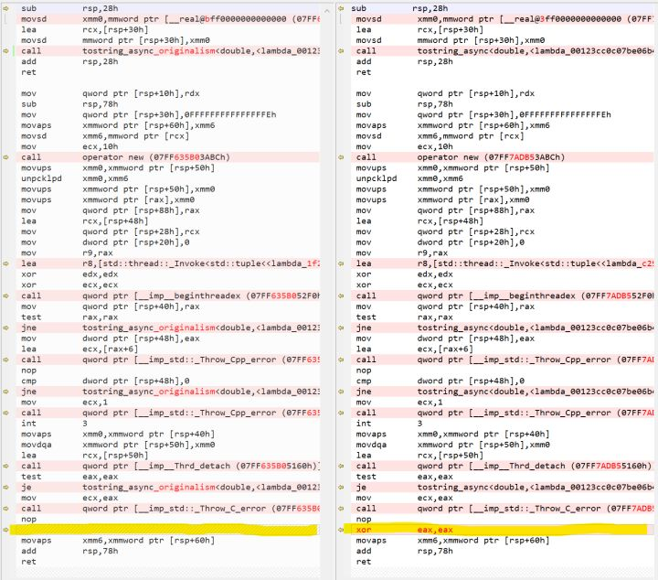

# Modern Callback

## 问题起源

在异步编程的历史上，callback霸占了程序员相当长的时间。一般来说，callback有两种做法：

一、一次设置回调，多次调用。

这种模式常见于异步网络中。即便到现在也有大量程序员坚持这种用法。好处显然是不用浪费每次设置回调的开销。但对于复杂逻辑来说，就不太友好了。因为回调入口只有一个，要实现复杂的逻辑，只能自己在回调里想方设法折腾。今天我们要谈的不是这种类型。

二、一次设置回调，一次调用。

这种模式常用于文件IO，因为这种类似的操作不会有多次结果。坏处嘛，当然是会在设置回调上多了开销，但应对复杂的逻辑来说，具有相当好的深度可供挖掘。今天重点就是要谈这种类型的回调中的一种。

一次设置，一次调用，还可以根据对失败的处理，细分下使用方式：

1、设置时失败，则返回错误信息，同时不会调用回调接口；

2、异步操作失败，不会调用回调接口；

3、异步操作失败会调用回调接口，但是取消异步操作则不会调用回调接口；

4、任何情况下都会调用回调接口；

今天要谈的就是第4种使用方式。我认为前三种使用方式都是错误的。特别是第一种，将失败处理硬生生拆分成两部分逻辑，看不到任何好处。

那么，第4种异步回调的常用代码大致如下：

    template<typename _Input_t, typename _Callable_t>
    void tostring_async(_Input_t&& value, _Callable_t&& callback) 
    {
        std::thread([callback = std::forward(callback), value = std::forward<_Input_t>(value)]
            {
                callback(std::to_string(value));
            }).detach();
    }
使用代码就不具体讨论了，但凡有异步编程经验的程序员都能想象该如何使用该函数。

然而，这样的回调用起来并没有那么美好。在复杂逻辑下，很快会陷入：

！！！CALLBACK HELL！！！

为了解决这种深度的连续回调逻辑，聪明的程序员又发明了调用链来解决。通常就是future+then方案。代码大致如下：

    template<typename _Input_t>
    std::future<std::string> tostring_async(_Input_t&& value)
    {
        return std::async([value = std::forward<_Input_t>(value)]
            {
                return std::to_string(value);
            });
    }
    
    //使用范例代码
    tostring_async(1.0).then(
    {
        std::cout << result << std::endl;
    });
然而，上面的代码目前并不能编译通过。因为std::future::then()是即将到来的C++20的功能。不管这段代码是否能编译通过，这种任务链的库还是挺多的，比较知名的如folly，以及比较不知名的libst。

再次然而，如果仅仅是非常非常深的连续回调，大部分程序员还能掌控，配合lambda食用，也不是什么难题。即便没有 future & then 可用的情况下，也只是要一个宽一点的显示器而已。现在的显示器都比较宽，不是问题。但是，要用回调模拟循环，然后再涉及到分支，大部分程序员就很难掌控了。即便诸如陈硕这样的大神，都讨厌这种逻辑。因为要实现循环分支，lambda就不是那么好用了。大体代码会长得像这个样子：

    void do_accept(...)
    {
        if (!ec)
            do_read(...);
    }
    void do_read(...)
    {
        if (!ec)
            do_write(...);
        else
            do_accept(...);
    }
    void do_write(...)
    {
        if (!ec)
            do_read(...);
    }
貌似走到了山穷水尽的末路！

但我们仔细想第二种做法的第4种使用方式，其内在逻辑，其实就是顺序执行逻辑。在不考虑异常的情况下，一行代码执行完毕后，必然会执行下一行代码，且只执行一次下一行代码。只不过在两行代码之间，插入了一个透明的延迟而已。那么，适用这种模式的解决方案就呼之欲出，那就是：协程！！！

哦，这个古老而富有魅力的美女，一下子就让我们拨云见日。赶紧的，支持下协程！以下代码以支持librf为例：

    template<typename _Input_t>
    resumef::future_t<std::string> tostring_async(_Input_t value)
    {
        resumef::promise_t<std::string> awaitable;
        std::thread([value, st = awaitable._state]
            {
                st->set_value(std::to_string(value));
            }).detach();
    
        return awaitable.get_future();
    }
    
    //使用范例代码
    std::string result = co_await tostring_async(val);
    std::cout << result << std::endl;

美，真美！循环，分支全都不是问题。简单到如初学写代码的码农都能掌握，谁还没写过顺序执行的代码呢？！

但是，等等，你的librf完善吗？稳定吗？高效吗？支持Linux吗？我想支持boost::fiber怎么办？我想支持libgo怎么办？

呵呵，能怎么办？赶紧回去996.ICU咯。我相信boost::fiber和libgo都提供了扩展的能力，你只需要翻一翻他们的文档，针对每一个异步函数写一遍适配代码，然后不要忘记写一遍测试范例。记得周末来加班哦！

但你大概率会在下周一继续犯愁。因为你用了一个第三方的异步库，你没权限，或者没源码，或者没能力(嗯有点尴尬)，去扩展这个库。

哦，你都有啊，很好，赶紧回去996.ICU咯。我相信你通过一周的加班加点，终于完美的扩展好了这个第三方异步库，并且针对每个函数每个功能都写了严格的测试范例，完美的完成了所有功能，确保了99.99999%的可靠性(然而还是会崩溃一两次），下一个季度的KPI有指望了！

但你还是有一定概率在下下个周一遇上意外。因为第三方库的作者发布申明，发现了N个XXX漏洞，针对这些漏洞，做了YYY修改，涉及到M个ZZZ接口。你一看ZZZ接口列表，一口老血就喷在了显示器上，然后就觉得这个世界正在变得黑暗，声音也逐渐离你远去----你昏倒在了工位上。

从医院缓缓苏醒的你，并没有放弃。因为你是如此的坚(gu)持(zhi)，是如此的优秀，以至于在昏倒的时候，耶稣上帝还有佛祖(哦还有三清)，感动得给你指明了一条康庄大道。就等你恢复了身体能自己下床尿尿后，把这条“道”给写出来！

妈耶，写了这么多，居然还没有进入正题，罪过罪过。不过，答应人家江南的东西，也总不能老用忙来拖延吧？期望下周没那么忙，能把Modern Callback(下一篇)写完。

## 解决方案

在上一篇文章中，乱七八糟的写了不少。主要讲述了使用原旨callback的异步库所面临的困难：callback本身难于使用，要将异步库改造得支持future-then范式，或者支持协程，需要更改每一个异步函数。而future库/协程库又选择繁多，要一一支持就需要一一的改写每个异步函数，导致工作量是乘法数量级。

那有没有一种办法，将乘法拆解成加法，并且还能保护已有的异步库代码呢？这就是我今天要讲的Modern Callback模式。

### 原旨callback

以一个异步转换字符串的函数为例，原旨主义的回调函数，大致长成这样：

    template<typename _Input_t, typename _Callable_t>
    void tostring_async(_Input_t&& value, _Callable_t&& callback)
    {
        std::thread([callback = std::move(callback), value = std::forward<_Input_t>(value)]
            {
                callback(std::to_string(value));
            }).detach();
    }
    
    //使用范例
    tostring_async(-1.0, 
    {
        std::cout << value << std::endl;
    });

### Modern callback

那么，要改造成现代的回调，应该怎么做呢？我给出了这样一个方案：

    //回调适配器的模板类
    //这个默认类以_Callable_t作为真正的回调
    //返回无意义的int，以便于编译通过
    template<typename _Callable_t, typename _Result_t>
    struct modern_callback_adapter_t
    {
        using return_type = int;
        using callback_type = _Callable_t;
    
        static std::tuple<callback_type, return_type> traits(_Callable_t&& callback)
        {
            return { std::forward<_Callable_t>(callback), 0 };
        }
    };
    
    //一个使用回调处理结果的异步函数，会涉及以下概念：
    //_Input_t...：异步函数的输入参数；
    //_Signature_t: 此异步回调的函数签名；应当满足‘void(_Exception_t, _Result_t...)’或者‘void(_Result_t...)’类型；
    //_Callable_t：回调函数或标记，如果是回调函数，则需要符合_Signature_t的签名类型。这个回调，必须调用一次，且只能调用一次；
    //_Return_t：异步函数的返回值；
    //_Result_t...：异步函数完成后的结果值，作为回调函数的入参部分；这个参数可以有零至多个；
    //_Exception_t：回调函数的异常， 如果不喜欢异常的则忽略这个部分，但就得异步代码将异常处置妥当；
    //
    //在回调适配器模型里，_Input_t/_Result_t/_Exception_t(可选)是异步函数提供的功能所固有的部分；_Callable_t/_Return_t
    //部分并不直接使用，而是通过适配器去另外处理。这样给予适配器一次扩展到future模式，调用链模式的机会，以及支持协程的机会。
    //
    //tostring_async 演示了在其他线程里，将_Input_t的输入值，转化为std::string类型的_Result_t。
    //然后调用_Signature_t为 ‘void(std::string &&)’ 类型的 _Callable_t。
    //忽视异常处理，故没有_Exception_t。
    //template<typename _Input_t, typename _Callable_t>
    auto tostring_async(_Input_t&& value, _Callable_t&& callback)
    //-> typename modern_callback_adapter_t<std::decay_t<_Callable_t>, std::string>::return_type
    {
        using _Result_t = std::string;
        //适配器类型
        using _Adapter_t = modern_callback_adapter_t<std::decay_t<_Callable_t>, _Result_t>;
        //通过适配器获得兼容_Callable_t类型的真正的回调，以及返回值_Return_t
        auto adapter = typename _Adapter_t::traits(std::forward<_Callable_t>(callback));
    
        //real_callback与callback未必是同一个变量，甚至未必是同一个类型
        std::thread([real_callback = std::move(std::get<0>(adapter)), value = std::forward<_Input_t>(value)]
            {
                real_callback(std::to_string(value));
            }).detach();
    
        //返回适配器的return_type变量
        return std::move(std::get<1>(adapter));
    }

看似增加了不少代码，但这些代码很模式化，完全可以用宏来简化（哎，又爱又恨的宏）：

    #define MODERN_CALLBACK_TRAITS(type) \
        using _Result_t = type; \
        using _Adapter_t = modern_callback_adapter_t<std::decay_t<_Callable_t>, _Result_t>; \
        auto adapter = typename _Adapter_t::traits(std::forward<_Callable_t>(callback))
    #define MODERN_CALLBACK_CALL() callback = std::move(std::get<0>(adapter))
    #define MODERN_CALLBACK_RETURN() return std::move(std::get<1>(adapter)) 
    
    template<typename _Input_t, typename _Callable_t>
    auto tostring_async(_Input_t&& value, _Callable_t&& callback)
    {
        MODERN_CALLBACK_TRAITS(std::string);
    
        std::thread([MODERN_CALLBACK_CALL(), value = std::forward<_Input_t>(value)]
            {
                callback(std::to_string(value));
            }).detach();

        MODERN_CALLBACK_RETURN();
    }

这样的修改，并不会大动干戈的修改现有的逻辑和代码。有N个支持回调的异步函数，也仅做N次修改，工作量并不大。

显然，通用的modern_callback_adapter_t没有做任何有效的事情，仅仅将callback转移了两次，不会影响到已有逻辑。现有的使用原旨callback范式的代码也不会受到任何影响，该怎么使用就还使用。

### 支持future-then

首先，看看不采用morden callback方案，需要如何支持future-then范式：

    template<typename _Input_t>
    auto tostring_async(_Input_t&& value)
    {
        std::promise<std::string> _promise;
        std::future<std::string> _future = _promise.get_future();

        std::thread([_promise = std::move(_promise), value = std::forward<_Input_t>(value)]() mutable
            {
                _promise.set_value(std::to_string(value));
            }).detach();

        return std::move(_future);
    }

代码倒是不复杂，也是需要针对N个异步函数做修改，工作量一个没少。但是，别忘记了future库可是有不少。

下面演示如何扩展tostring_async函数，以支持future模式：

    //一、做一个辅助类
    struct use_future_t {};
    //二、申明这个辅助类的全局变量。不申明这个变量也行，就是每次要写use_future_t{}，麻烦些。
    //以后就使用use_future，替代tostring_async的callback参数了。
    //这个参数其实不需要实质传参，最后会被编译器优化没了。
    //仅仅是要指定_Callable_t的类型为use_future_t，
    //从而在tostring_async函数内，使用偏特化的modern_callback_adapter_t<use_future_t, ...>版本而已。
    inline constexpr use_future_t use_future{};

    //将替换use_future_t的，真正的回调类。
    //此回调类，符合tostring_async的_Callable_t函数签名。
    //生成此类的实例作为real_callback交给tostring_async作为异步回调。
    //
    //future模式下，此类持有一个std::promise<_Result_t>，便于设置值和异常
    //而将与promise关联的future作为返回值_Return_t，让tostring_async返回。
    template<typename _Result_t>
    struct use_future_callback_t
    {
        using promise_type = std::promise<_Result_t>;

        mutable promise_type _promise;

        void operator()(_Result_t&& value) const
        {
            _promise.set_value(value);
        }

        void operator()(_Result_t&& value, std::exception_ptr&& eptr) const
        {
            if (eptr != nullptr)
                _promise.set_exception(std::forward<std::exception_ptr>(eptr));
            else
                _promise.set_value(std::forward<_Result_t>(value));
        }
    };

    //偏特化_Callable_t为use_future_t类型的modern_callback_adapter_t
    //真正的回调类型是use_future_callback_t，返回类型_Return_t是std::future<_Result_t>。
    //配合use_future_callback_t的std::promise<_Result_t>，正好组成一对promise/future对。
    //promise在真正的回调里设置结果值；
    //future返回给调用者获取结果值。
    template<typename _Result_t>
    struct modern_callback_adapter_t<use_future_t, _Result_t>
    {
        using return_type = std::future<_Result_t>;
        using callback_type = use_future_callback_t<_Result_t>;

        static std::tuple<callback_type, return_type> traits(const use_future_t&/*没人关心这个变量*/)
        {
            callback_type real_callback{};
            return_type future = real_callback._promise.get_future();

            return { std::move(real_callback), std::move(future) };
        }
    };

哦，看起来代码增加了不少。但是，这样的代码只需要针对所选择的future库写一次，就可以支持全部的N个异步函数了。使用范例如下：

    std::future<std::string> f2 = tostring_async(6.0f, use_future);
    std::cout << f2.get() << std::endl;

### 协程中使用

我们的终极目的是协程，只有使用了协程后，才可以非常容易的支持循环+分支逻辑。下面以librf为例，看看如何去支持协程：

    //同理，可以制作支持C++20的协程的下列一系列类（其实，这才是我的最终目的）
    struct use_awaitable_t {};
    inline constexpr use_awaitable_t use_awaitable{};

    template<typename _Result_t>
    struct use_awaitable_callback_t
    {
        using promise_type = resumef::promise_t<_Result_t>;
        using state_type = typename promise_type::state_type;

        resumef::counted_ptr<state_type> _state;

        void operator()(_Result_t&& value) const
        {
            _state->set_value(std::forward<_Result_t>(value));
        }
        void operator()(_Result_t&& value, std::exception_ptr&& eptr) const
        {
            if (eptr != nullptr)
                _state->set_exception(std::forward<std::exception_ptr>(eptr));
            else
                _state->set_value(std::forward<_Result_t>(value));
        }
    };

    template<typename _Result_t>
    struct modern_callback_adapter_t<use_awaitable_t, _Result_t>
    {
        using promise_type = resumef::promise_t<_Result_t>;
        using return_type = resumef::future_t<_Result_t>;
        using callback_type = use_awaitable_callback_t<_Result_t>;

        static std::tuple<callback_type, return_type> traits(const use_awaitable_t&)
        {
            promise_type promise;
            return { callback_type{ promise._state }, promise.get_future() };
        }
    };

不要看见这些代码就害怕，记住，这样的代码只写一次！O(1)的算法就是最好的，所以，只写一次的代码也是最好的！下面看看如何使用：

    std::string result = co_await tostring_async(10.0, use_awaitable);
    std::cout << result << std::endl;

仅仅是替换callback参数，就达到了使用协程的目的。并且，只需要为选择的协程库写一次适配代码就可以了。

对比下代码量的修改：

异步库有N个异步函数

有三种异步支持方案：callback，future-then，coroutine，其中，可选择的库有folly,libst,libgo,librf等K个。

    则原旨主义的回调方案，需要做N*K次修改。
    而采用modern callback方案，只需要做N+K次适配。

显然，这是一个更好的方案。

并且，当异步库修改了M个异步函数后

    原旨主义的callback方案，需要做M*K次修改；
    而modern callback不需要在适配上做任何修改，编译一次就好了。

### 运行效率

那么，modern callback引入的modern_callback_adapter_t是不是会严重影响效率呢？答案是：不会的。我们以编译出来的汇编代码为例：

可以看到，modern callback对比originalism callback，仅仅多引入了一个'xor eax，eax'指令。

(在最终版本，多出来的'xor eax, eax'也被消除了)

## 总结

可以看到，modern callback通过增加一个适配器，做微量代码的修改情况下，既能保护现有的callback逻辑不变，又能增加对future-then模式，对coroutine的支持。将原来需要乘法数量级的修改，变成加法数量级的修改，减少代码的同时，大家也更好的955.WLB。
本文章的范例代码：librf/modern callback
最后，感谢江南的发稿邀请，让我有动力将modern callback想法写成文章，这原本是在QQ群（296561497）里的一场讨论。欢迎大家加入此群，此群里管理严格，氛围良好，并且绝对不开车，是一个学习Modern C++的好去处！
2019年4月25日更新：
本文章的范例代码：librf/modern callback已经更新，详情请点击链接查看。
范例代码不再考虑写文章的需要而进行简化了，因此，可能会更难看一些。但增加了下列功能：
一、增加了对异常/错误码的支持；
二、增加了对多结果值的支持；
三、用一套代码对兼容std::future用法的库提供了支持，使得扩展兼容std::future用法的代码更加简单；
四、适配器使用间接返回，消除了多余的'xor eax, eax'代码，使得Modern Callback效率完全等同与原旨主义的callback；

注一：本文最先发表于知乎，随后发表于purecpp。原文链接：

    http://purecpp.org/detail?id=2114
    http://purecpp.org/detail?id=2116

注二：范例代码不再考虑写文章的需要而进行简化了，因此，可能会更难看一些。但增加了下列功能：

    一、增加了对异常/错误码的支持；
    二、增加了对多结果值的支持；
    三、用一套代码对兼容std::future用法的库提供了支持，使得扩展兼容std::future用法的代码更加简单；
    四、适配器使用间接返回，消除了多余的'xor eax, eax'代码，使得Modern Callback效率完全等同与原旨主义的callback；
